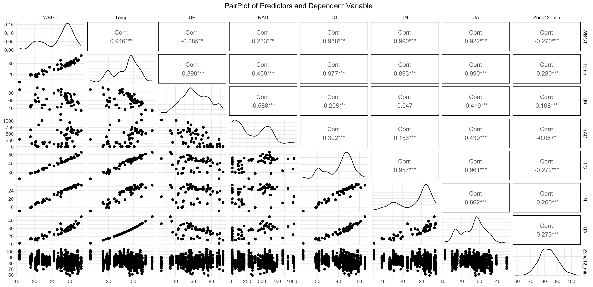

# Supplementary material

## Linearity check
**Fig S1: PairPlot between continuous predictors and high intensity distance covered per minute (Zones 4 and 5)**

**Supplementary Figure 1:** Visual representation of the relationships between each continuous predictor and the outcome variable, high-intensity distance covered per minute (Zones 4 and 5). The lower half displays scatterplots, the upper half shows correlation coefficients, and the diagonal shows frequency distributions via histograms. WBGT: wet bulb globe temperature; Temp: dry air temperature; UR: relative humidity; Rad: radiation; TG: globe temperatue; TN: wet bulb temperatuer; UA: absolute humidity.

**Fig S2: PairPlot between continuous predictors and moderate intensity distance covered per minute (Zone 3)**

**Supplementary Figure 2:** Visual representation of the relationships between each continuous predictor and the outcome variable, moderate-intensity distance covered per minute (Zone 3). The lower half displays scatterplots, the upper half shows correlation coefficients, and the diagonal shows frequency distributions via histograms. WBGT: wet bulb globe temperature; Temp: dry air temperature; UR: relative humidity; Rad: radiation; TG: globe temperatue; TN: wet bulb temperatuer; UA: absolute humidity.

**Fig S3: PairPlot between continuous predictors and low intensity distance covered per minute (Zones 1 and 2).**

**Supplementary Figure 3:** Visual representation of the relationships between each continuous predictor and the outcome variable, low-intensity distance covered per minute (Zones 1 and 2). The lower half displays scatterplots, the upper half shows correlation coefficients, and the diagonal shows frequency distributions via histograms. WBGT: wet bulb globe temperature; Temp: dry air temperature; UR: relative humidity; Rad: radiation; TG: globe temperatue; TN: wet bulb temperatuer; UA: absolute humidity.

**Fig S4: PairPlot between continuous predictors and total distance covered per minute**

**Supplementary Figure 4:** Visual representation of the relationships between each continuous predictor and the outcome variable, total distance covered per minute. The lower half displays scatterplots, the upper half shows correlation coefficients, and the diagonal shows frequency distributions via histograms. WBGT: wet bulb globe temperature; Temp: dry air temperature; UR: relative humidity; Rad: radiation; TG: globe temperatue; TN: wet bulb temperatuer; UA: absolute humidity.

## MODEL 1 - Assumption checks
VD ~ Stage + Time_of_day + Ranking_difference + Player_position + Player_age_c + Origin_climate + WBGT_c + (1 | Player_id) + Time_of_day * WBGT_c

### High intensity distance covered per minute (Zones 4 and 5)
**Table S1. Multicollinearity diagnosis**
|Predictor | VIF | VIF 95% CI | Increased SE | Tolerance | Tolerance 95% CI|
|:-----:|:-----:|:-------:|:--------------:|:-----------:|:-----------------:|
| Stage | 1.23 | [1.16, 1.34] | 1.11 | 0.81 | [0.75, 0.86] |
| Time_of_day | 1.22 | [1.15, 1.32] | 1.10 | 0.82 | [0.76, 0.87] |
| Ranking_difference | 1.15 | [1.09, 1.25] | 1.07 | 0.87 | [0.80, 0.92] |
| Player_position | 1.02 | [1.00, 1.42] | 1.01 | 0.98 | [0.71, 1.00] |
| Player_age_c | 1.04 | [1.01, 1.19] | 1.02 | 0.96 | [0.84, 0.99] |
| Origin_climate | 1.05 | [1.01, 1.18] | 1.02 | 0.95 | [0.84, 0.99] |
| WBGT_c | 1.69 | [1.56, 1.85] | 1.30 | 0.59 | [0.54, 0.64] |
| Time_of_day:WBGT_c | 1.59 | [1.47, 1.73] | 1.26 | 0.63 | [0.58, 0.68] |

**Supplementary Table 1:** Results of the multicollinearity diagnosis for model 1 and and the outcome variable high intensity distance covered per minute. Variance Inflation Factor (VIF), Increased Standard Error, and Tolerance values for each predictor in the model. These metrics assess the degree of multicollinearity among the continuous predictor variables. VIF > 10 indicates high multicollinearity and VIF > 5 indicates moderate multicollinearity.
 
**Fig S5: Histogram and Q-Q Plot of residuals; scatterplot residuals x fitted. Graphical analysis of normality and homoscedasticity of residuals**

**Supplementary Figure 5:** Graphical analysis of the model residuals for assumptions assessment. The histogram and Q-Q plot were used to visually assess the normality of the residuals. The scatterplot of residuals versus fitted values was used to assess the assumption of homoscedasticity.

**Fig S6: Histogram and Q-Q Plot of random effects**

**Supplementary Figure 6**: Graphical assessment of the normality of the random effects. The histograms and Q-Q plots for each random effect are used to visually confirm the assumption that they are normally distributed.

**Table S2: Kolmogorov-Smirnov test for residuals and random effects normality check**
|Data| D | p-value|
|:--:|:--:|:-----:|
|Residuals|0.04|0.003*|
|Random effects|0.05|0.01*|

**Supplementary Table 2:** Kolmogorov-Smirnov test results to check the assumption of normality for both the model residuals and the random effects. The table shows the D statistic and the p-value for each test.

### Moderate intensity distance covered per minute (Zone 3)
**Table S3. Multicollinearity diagnosis**
|Predictor | VIF | VIF 95% CI | Increased SE | Tolerance | Tolerance 95% CI|
|:-----:|:-----:|:-------:|:--------------:|:-----------:|:-----------------:|
| Stage | 1.26 | [1.18, 1.36] | 1.12 | 0.80 | [0.73, 0.85] |
| Time_of_day | 1.22 | [1.15, 1.33] | 1.11 | 0.82 | [0.75, 0.87] |
| Ranking_difference | 1.18 | [1.11, 1.28] | 1.08 | 0.85 | [0.78, 0.90] |
| Player_position | 1.02 | [1.00, 1.47] | 1.01 | 0.98 | [0.68, 1.00] |
| Player_age_c | 1.04 | [1.01, 1.20] | 1.02 | 0.96 | [0.83, 0.99] |
| Origin_climate | 1.04 | [1.01, 1.19] | 1.02 | 0.96 | [0.84, 0.99] |
| WBGT_c | 1.68 | [1.56, 1.84] | 1.30 | 0.59 | [0.54, 0.64] |
| Time_of_day:WBGT_c | 1.57 | [1.46, 1.71] | 1.25 | 0.64 | [0.58, 0.69] |

**Supplementary Table 3:** Results of the multicollinearity diagnosis for model 1 and and the outcome variable moderate intensity distance covered per minute. Variance Inflation Factor (VIF), Increased Standard Error, and Tolerance values for each predictor in the model. These metrics assess the degree of multicollinearity among the continuous predictor variables. VIF > 10 indicates high multicollinearity and VIF > 5 indicates moderate multicollinearity.

**Fig S7: Histogram and Q-Q Plot of residuals; scatterplot residuals x fitted. Graphical analysis of normality and homoscedasticity of residuals**

**Supplementary Figure 7:** Graphical analysis of the model residuals for assumptions assessment. The histogram and Q-Q plot were used to visually assess the normality of the residuals. The scatterplot of residuals versus fitted values was used to assess the assumption of homoscedasticity.

**Fig S8: Histogram and Q-Q Plot of random effects**

**Supplementary Figure 8**: Graphical assessment of the normality of the random effects. The histograms and Q-Q plots for each random effect are used to visually confirm the assumption that they are normally distributed.

**Table S4: Kolmogorov-Smirnov test for residuals and random effects normality check**
|Data| D | p-value|
|:--:|:--:|:-----:|
|Residuals|0.03|0.009*|
|Random effects|0.04|0.05|

**Supplementary Table 4:** Kolmogorov-Smirnov test results to check the assumption of normality for both the model residuals and the random effects. The table shows the D statistic and the p-value for each test.

### Low intensity distance covered per minute (Zones 1 and 2)
**Table S5. Multicollinearity diagnosis**
|Predictor | VIF | VIF 95% CI | Increased SE | Tolerance | Tolerance 95% CI|
|:-----:|:-----:|:-------:|:--------------:|:-----------:|:-----------------:|
| Stage | 1.24 | [1.17, 1.34] | 1.11 | 0.81 | [0.74, 0.86] |
| Time_of_day | 1.22 | [1.15, 1.32] | 1.10 | 0.82 | [0.76, 0.87] |
| Ranking_difference | 1.16 | [1.10, 1.26] | 1.08 | 0.86 | [0.80, 0.91] |
| Player_position | 1.02 | [1.00, 1.43] | 1.01 | 0.98 | [0.70, 1.00] |
| Player_age_c | 1.04 | [1.01, 1.19] | 1.02 | 0.96 | [0.84, 0.99] |
| Origin_climate | 1.05 | [1.01, 1.19] | 1.02 | 0.95 | [0.84, 0.99] |
| WBGT_c | 1.69 | [1.56, 1.85] | 1.30 | 0.59 | [0.54, 0.64] |
| Time_of_day:WBGT_c | 1.58 | [1.47, 1.73] | 1.26 | 0.63 | [0.58, 0.68] |

**Supplementary Table 5:** Results of the multicollinearity diagnosis for model 1 and and the outcome variable low intensity distance covered per minute. Variance Inflation Factor (VIF), Increased Standard Error, and Tolerance values for each predictor in the model. These metrics assess the degree of multicollinearity among the continuous predictor variables. VIF > 10 indicates high multicollinearity and VIF > 5 indicates moderate multicollinearity.

**Fig S9: Histogram and Q-Q Plot of residuals; scatterplot residuals x fitted. Graphical analysis of normality and homoscedasticity of residuals**

**Supplementary Figure 9:** Graphical analysis of the model residuals for assumptions assessment. The histogram and Q-Q plot were used to visually assess the normality of the residuals. The scatterplot of residuals versus fitted values was used to assess the assumption of homoscedasticity.

**Fig S10: Histogram and Q-Q Plot of random effects**

**Supplementary Figure 10**: Graphical assessment of the normality of the random effects. The histograms and Q-Q plots for each random effect are used to visually confirm the assumption that they are normally distributed.

**Table S6: Kolmogorov-Smirnov test for residuals and random effects normality check**
|Data| D | p-value|
|:--:|:--:|:-----:|
|Residuals|0.02|0.4|
|Random effects|0.03|0.5|

**Supplementary Table 6:** Kolmogorov-Smirnov test results to check the assumption of normality for both the model residuals and the random effects. The table shows the D statistic and the p-value for each test.

### Total distance covered per minute
**Table S7. Multicollinearity diagnosis**
|Predictor | VIF | VIF 95% CI | Increased SE | Tolerance | Tolerance 95% CI|
|:-----:|:-----:|:-------:|:--------------:|:-----------:|:-----------------:|
|Stage|1.26 |[1.18, 1.37]|    1.12      |    0.79   |  [0.73, 0.85]   |
|Time_of_day| 1.22 |[1.15, 1.33]  |       1.11  |    0.82   |  [0.75, 0.87]|
|Ranking_difference| 1.18| [1.12, 1.28]|         1.09|      0.85|     [0.78, 0.90]|
|Player_position |1.02| [1.00, 1.47]|         1.01|      0.98|     [0.68, 1.00]|
|Player_age_c | 1.04 | [1.01, 1.20] |        1.02|      0.96 |    [0.83, 0.99]|
|Origin_climate |1.04| [1.01, 1.19] |        1.02|      0.96 |     [0.84, 0.99]|
|WBGT_c |1.68 | [1.55, 1.84]|         1.30 |     0.59 |    [0.54, 0.64]|
|Time_of_day:WBGT_c | 1.57 | [1.46, 1.71] |        1.25|      0.64|     [0.58, 0.69]|

**Supplementary Table 7:** Results of the multicollinearity diagnosis for model 1 and and the outcome variable total distance covered per minute. Variance Inflation Factor (VIF), Increased Standard Error, and Tolerance values for each predictor in the model. These metrics assess the degree of multicollinearity among the continuous predictor variables. VIF > 10 indicates high multicollinearity and VIF > 5 indicates moderate multicollinearity.

**Fig S11: Histogram and Q-Q Plot of residuals; scatterplot residuals x fitted. Graphical analysis of normality and homoscedasticity of residuals**

**Supplementary Figure 11:** Graphical analysis of the model residuals for assumptions assessment. The histogram and Q-Q plot were used to visually assess the normality of the residuals. The scatterplot of residuals versus fitted values was used to assess the assumption of homoscedasticity.

**Fig S12: Histogram and Q-Q Plot of random effects**

**Supplementary Figure 12**: Graphical assessment of the normality of the random effects. The histograms and Q-Q plots for each random effect are used to visually confirm the assumption that they are normally distributed.

**Table S8: Kolmogorov-Smirnov test for residuals and random effects normality check**
|Data| D | p-value|
|:--:|:--:|:-----:|
|Residuals|0.03|0.04*|
|Random effects|0.02|0.9|

**Supplementary Table 8:** Kolmogorov-Smirnov test results to check the assumption of normality for both the model residuals and the random effects. The table shows the D statistic and the p-value for each test.

## MODEL 2 - Assumption checks
VD ~ Stage + Time_of_day + Ranking_difference + Player_position + Player_age_c + Origin_climate + Temp_c + UR_c + RAD_c + (1 | Player_id) + Time_of_day * Temp_c + Time_of_day * UR_c

### High intensity distance covered per minute (Zones 4 and 5)
**Table S9. Multicollinearity diagnosis**
|Predictor | VIF | VIF 95% CI | Increased SE | Tolerance | Tolerance 95% CI|
|:-----:|:-----:|:-------:|:--------------:|:-----------:|:-----------------:|
| Stage | 1.51 | [1.40, 1.65] | 1.23 | 0.66 | [0.61, 0.71] |
| Time_of_day | 4.51 | [4.06, 5.01] | 2.12 | 0.22 | [0.20, 0.25] |
| Ranking_difference | 1.16 | [1.10, 1.26] | 1.08 | 0.86 | [0.80, 0.91] |
| Player_position | 1.02 | [1.00, 1.39] | 1.01 | 0.98 | [0.72, 1.00] |
| Player_age_c | 1.04 | [1.01, 1.19] | 1.02 | 0.96 | [0.84, 0.99] |
| Origin_climate | 1.05 | [1.02, 1.18] | 1.03 | 0.95 | [0.85, 0.98] |
| Temp_c | 3.04 | [2.76, 3.36] | 1.74 | 0.33 | [0.30, 0.36] |
| UR_c | 4.13 | [3.73, 4.59] | 2.03 | 0.24 | [0.22, 0.27] |
| Time_of_day:Temp_c | 1.92 | [1.76, 2.10] | 1.38 | 0.52 | [0.48, 0.57] |
| Time_of_day:UR_c | 2.15 | [1.97, 2.37] | 1.47 | 0.46 | [0.42, 0.51] |
| RAD_c | 5.44 | [4.89, 6.06] | 2.33 | 0.18 | [0.16, 0.20] |

**Supplementary Table 9:** Results of the multicollinearity diagnosis for model 2 and and the outcome variable high intensity distance covered per minute. Variance Inflation Factor (VIF), Increased Standard Error, and Tolerance values for each predictor in the model. These metrics assess the degree of multicollinearity among the continuous predictor variables. VIF > 10 indicates high multicollinearity and VIF > 5 indicates moderate multicollinearity.

**Fig S13: Histogram and Q-Q Plot of residuals; scatterplot residuals x fitted. Graphical analysis of normality and homoscedasticity of residuals**

**Supplementary Figure 13:** Graphical analysis of the model residuals for assumptions assessment. The histogram and Q-Q plot were used to visually assess the normality of the residuals. The scatterplot of residuals versus fitted values was used to assess the assumption of homoscedasticity.

**Fig S14: Histogram and Q-Q Plot of random effects**

**Supplementary Figure 14**: Graphical assessment of the normality of the random effects. The histograms and Q-Q plots for each random effect are used to visually confirm the assumption that they are normally distributed.

**Table S10: Kolmogorov-Smirnov test for residuals and random effects normality check**
|Data| D | p-value|
|:--:|:--:|:-----:|
|Residuals|0.04|0.001*|
|Random effects|0.05|0.004*|

**Supplementary Table 10:** Kolmogorov-Smirnov test results to check the assumption of normality for both the model residuals and the random effects. The table shows the D statistic and the p-value for each test.

### Moderate intensity distance covered per minute (Zone 3)
**Table S11. Multicollinearity diagnosis**
|Predictor | VIF | VIF 95% CI | Increased SE | Tolerance | Tolerance 95% CI|
|:-----:|:-----:|:-------:|:--------------:|:-----------:|:-----------------:|
| Stage | 1.55 | [1.44, 1.69] | 1.25 | 0.64 | [0.59, 0.69] |
| Time_of_day | 4.50 | [4.05, 5.00] | 2.12 | 0.22 | [0.20, 0.25] |
| Ranking_difference | 1.19 | [1.12, 1.29] | 1.09 | 0.84 | [0.78, 0.89] |
| Player_position | 1.02 | [1.00, 1.44] | 1.01 | 0.98 | [0.70, 1.00] |
| Player_age_c | 1.04 | [1.01, 1.20] | 1.02 | 0.96 | [0.84, 0.99] |
| Origin_climate | 1.05 | [1.01, 1.18] | 1.02 | 0.95 | [0.84, 0.99] |
| Temp_c | 3.16 | [2.87, 3.50] | 1.78 | 0.32 | [0.29, 0.35] |
| UR_c | 4.19 | [3.78, 4.65] | 2.05 | 0.24 | [0.21, 0.26] |
| Time_of_day:Temp_c | 1.92 | [1.76, 2.10] | 1.38 | 0.52 | [0.48, 0.57] |
| Time_of_day:UR_c | 2.14 | [1.97, 2.36] | 1.46 | 0.47 | [0.42, 0.51] |
| RAD_c | 5.44 | [4.89, 6.06] | 2.33 | 0.18 | [0.17, 0.20] |

**Supplementary Table 11:** Results of the multicollinearity diagnosis for model 2 and and the outcome variable moderate intensity distance covered per minute. Variance Inflation Factor (VIF), Increased Standard Error, and Tolerance values for each predictor in the model. These metrics assess the degree of multicollinearity among the continuous predictor variables. VIF > 10 indicates high multicollinearity and VIF > 5 indicates moderate multicollinearity.

**Fig S15: Histogram and Q-Q Plot of residuals; scatterplot residuals x fitted. Graphical analysis of normality and homoscedasticity of residuals**

**Supplementary Figure 15:** Graphical analysis of the model residuals for assumptions assessment. The histogram and Q-Q plot were used to visually assess the normality of the residuals. The scatterplot of residuals versus fitted values was used to assess the assumption of homoscedasticity.

**Fig S16: Histogram and Q-Q Plot of random effects**

**Supplementary Figure 16**: Graphical assessment of the normality of the random effects. The histograms and Q-Q plots for each random effect are used to visually confirm the assumption that they are normally distributed.

**Table S12: Kolmogorov-Smirnov test for residuals and random effects normality check**
|Data| D | p-value|
|:--:|:--:|:-----:|
|Residuals|0.04|0.002*|
|Random effects|0.04|0.09|

**Supplementary Table 12:** Kolmogorov-Smirnov test results to check the assumption of normality for both the model residuals and the random effects. The table shows the D statistic and the p-value for each test.

### Low intensity distance covered per minute (Zones 1 and 2)
**Table S13. Multicollinearity diagnosis**
|Predictor | VIF | VIF 95% CI | Increased SE | Tolerance | Tolerance 95% CI|
|:-----:|:-----:|:-------:|:--------------:|:-----------:|:-----------------:|
| Stage | 1.52 | [1.41, 1.65] | 1.23 | 0.66 | [0.60, 0.71] |
| Time_of_day | 4.50 | [4.06, 5.01] | 2.12 | 0.22 | [0.20, 0.25] |
| Ranking_difference | 1.16 | [1.10, 1.26] | 1.08 | 0.86 | [0.79, 0.91] |
| Player_position | 1.02 | [1.00, 1.40] | 1.01 | 0.98 | [0.71, 1.00] |
| Player_age_c | 1.04 | [1.01, 1.19] | 1.02 | 0.96 | [0.84, 0.99] |
| Origin_climate | 1.05 | [1.02, 1.18] | 1.03 | 0.95 | [0.85, 0.99] |
| Temp_c | 3.06 | [2.78, 3.39] | 1.75 | 0.33 | [0.30, 0.36] |
| UR_c | 4.14 | [3.74, 4.60] | 2.04 | 0.24 | [0.22, 0.27] |
| Time_of_day:Temp_c | 1.92 | [1.76, 2.10] | 1.38 | 0.52 | [0.48, 0.57] |
| Time_of_day:UR_c | 2.15 | [1.97, 2.37] | 1.47 | 0.46 | [0.42, 0.51] |
| RAD_c | 5.44 | [4.89, 6.06] | 2.33 | 0.18 | [0.17, 0.20] |

**Supplementary Table 13:** Results of the multicollinearity diagnosis for model 2 and and the outcome variable low intensity distance covered per minute. Variance Inflation Factor (VIF), Increased Standard Error, and Tolerance values for each predictor in the model. These metrics assess the degree of multicollinearity among the continuous predictor variables. VIF > 10 indicates high multicollinearity and VIF > 5 indicates moderate multicollinearity.

**Fig S17: Histogram and Q-Q Plot of residuals; scatterplot residuals x fitted. Graphical analysis of normality and homoscedasticity of residuals**

**Supplementary Figure 17:** Graphical analysis of the model residuals for assumptions assessment. The histogram and Q-Q plot were used to visually assess the normality of the residuals. The scatterplot of residuals versus fitted values was used to assess the assumption of homoscedasticity.

**Fig S18: Histogram and Q-Q Plot of random effects**

**Supplementary Figure 18**: Graphical assessment of the normality of the random effects. The histograms and Q-Q plots for each random effect are used to visually confirm the assumption that they are normally distributed.

**Table S14: Kolmogorov-Smirnov test for residuals and random effects normality check**
|Data| D | p-value|
|:--:|:--:|:-----:|
|Residuals|0.02|0.4|
|Random effects|0.03|0.3|

**Supplementary Table 14:** Kolmogorov-Smirnov test results to check the assumption of normality for both the model residuals and the random effects. The table shows the D statistic and the p-value for each test.

### Total distance covered per minute
**Table S15. Multicollinearity diagnosis**
|Predictor | VIF | VIF 95% CI | Increased SE | Tolerance | Tolerance 95% CI|
|:-----:|:-----:|:-------:|:--------------:|:-----------:|:-----------------:|
|Stage| 1.56 |[1.44, 1.70]|         1.25|      0.64|     [0.59, 0.69]|
|Time_of_day |4.49 |[4.05, 5.00] |        2.12|      0.22|     [0.20, 0.25]|
|Ranking_difference |1.19 |[1.12, 1.29]|         1.09|      0.84|     [0.77, 0.89]|
|Player_position | 1.02 |[1.00, 1.44] |         1.01|      0.98|     [0.69, 1.00]|
|Player_age_c | 1.04| [1.01, 1.20]|         1.02|      0.96|     [0.84, 0.99]|
|Origin_climate |1.05 |[1.01, 1.19]|         1.02|      0.95|     [0.84, 0.99]|
|Temp_c |3.17 |[2.87, 3.51] |        1.78|      0.32|     [0.29, 0.35]|
|UR_c |4.19 |[3.78, 4.66]|         2.05|      0.24|     [0.21, 0.26]|
|Time_of_day:Temp_c |1.92| [1.76, 2.10]|         1.38|      0.52|     [0.48, 0.57]|
|Time_of_day:UR_c |2.14 |[1.96, 2.35] |        1.46|      0.47|     [0.42, 0.51]|
|RAD_c |5.44 |[4.89, 6.06]|         2.33|      0.18|     [0.17, 0.20]|

**Supplementary Table 15:** Results of the multicollinearity diagnosis for model 2 and and the outcome variable total distance covered per minute. Variance Inflation Factor (VIF), Increased Standard Error, and Tolerance values for each predictor in the model. These metrics assess the degree of multicollinearity among the continuous predictor variables. VIF > 10 indicates high multicollinearity and VIF > 5 indicates moderate multicollinearity.

**Fig S19: Histogram and Q-Q Plot of residuals; scatterplot residuals x fitted. Graphical analysis of normality and homoscedasticity of residuals**

**Supplementary Figure 19:** Graphical analysis of the model residuals for assumptions assessment. The histogram and Q-Q plot were used to visually assess the normality of the residuals. The scatterplot of residuals versus fitted values was used to assess the assumption of homoscedasticity.

**Fig S20: Histogram and Q-Q Plot of random effects**

**Supplementary Figure 20**: Graphical assessment of the normality of the random effects. The histograms and Q-Q plots for each random effect are used to visually confirm the assumption that they are normally distributed.

**Table S16: Kolmogorov-Smirnov test for residuals and random effects normality check**
|Data| D | p-value|
|:--:|:--:|:-----:|
|Residuals|0.03|0.06|
|Random effects|0.02|0.9|

**Supplementary Table 16:** Kolmogorov-Smirnov test results to check the assumption of normality for both the model residuals and the random effects. The table shows the D statistic and the p-value for each test.

## MODEL 5 - Assumption checks
VD ~ Stage + Time_of_day + Ranking_difference + Player_position + Player_age_c + Origin_climate + WBGT_c + UR_c + (1 | Player_id) + Time_of_day * UR_c + Time_of_day * WBGT_c

### High intensity distance covered per minute (Zones 4 and 5)
**Table S17. multicollinearity diagnosis**
|Predictor | VIF | VIF 95% CI | Increased SE | Tolerance | Tolerance 95% CI|
|:-----:|:-----:|:-------:|:--------------:|:-----------:|:-----------------:|
| Stage | 1.38 | [1.29, 1.50] | 1.18 | 0.72 | [0.66, 0.77] |
| Time_of_day | 1.36 | [1.27, 1.48] | 1.17 | 0.74 | [0.68, 0.79] |
| Ranking_difference | 1.15 | [1.09, 1.25] | 1.07 | 0.87 | [0.80, 0.92] |
| Player_position | 1.02 | [1.00, 1.40] | 1.01 | 0.98 | [0.71, 1.00] |
| Player_age_c | 1.04 | [1.01, 1.19] | 1.02 | 0.96 | [0.84, 0.99] |
| Origin_climate | 1.05 | [1.01, 1.18] | 1.03 | 0.95 | [0.85, 0.99] |
| WBGT_c | 2.06 | [1.89, 2.26] | 1.43 | 0.49 | [0.44, 0.53] |
| UR_c | 2.09 | [1.92, 2.30] | 1.45 | 0.48 | [0.44, 0.52] |
| Time_of_day:UR_c | 1.72 | [1.59, 1.88] | 1.31 | 0.58 | [0.53, 0.63] |
| Time_of_day:WBGT_c | 1.70 | [1.57, 1.86] | 1.30 | 0.59 | [0.54, 0.64] |

**Supplementary Table 17:** Results of the multicollinearity diagnosis for model 5 and and the outcome variable high intensity distance covered per minute. Variance Inflation Factor (VIF), Increased Standard Error, and Tolerance values for each predictor in the model. These metrics assess the degree of multicollinearity among the continuous predictor variables. VIF > 10 indicates high multicollinearity and VIF > 5 indicates moderate multicollinearity.

**Fig S21: Histogram and Q-Q Plot of residuals; scatterplot residuals x fitted. Graphical analysis of normality and homoscedasticity of residuals**

**Supplementary Figure 21:** Graphical analysis of the model residuals for assumptions assessment. The histogram and Q-Q plot were used to visually assess the normality of the residuals. The scatterplot of residuals versus fitted values was used to assess the assumption of homoscedasticity.

**Fig S22: Histogram and Q-Q Plot of random effects**

**Supplementary Figure 22**: Graphical assessment of the normality of the random effects. The histograms and Q-Q plots for each random effect are used to visually confirm the assumption that they are normally distributed.

**Table S18: Kolmogorov-Smirnov test for residuals and random effects normality check**
|Data| D | p-value|
|:--:|:--:|:-----:|
|Residuals|0.04|0.0009*|
|Random effects|0.05|0.006*|

**Supplementary Table 18:** Kolmogorov-Smirnov test results to check the assumption of normality for both the model residuals and the random effects. The table shows the D statistic and the p-value for each test.

### Moderate intensity distance covered per minute (Zone 3)
**Table S19. multicollinearity diagnosis**
|Predictor | VIF | VIF 95% CI | Increased SE | Tolerance | Tolerance 95% CI|
|:-----:|:-----:|:-------:|:--------------:|:-----------:|:-----------------:|
| Stage | 1.42 | [1.33, 1.55] | 1.19 | 0.70 | [0.65, 0.75] |
| Time_of_day | 1.36 | [1.27, 1.48] | 1.17 | 0.74 | [0.68, 0.79] |
| Ranking_difference | 1.18 | [1.12, 1.28] | 1.09 | 0.85 | [0.78, 0.89] |
| Player_position | 1.02 | [1.00, 1.45] | 1.01 | 0.98 | [0.69, 1.00] |
| Player_age_c | 1.04 | [1.01, 1.20] | 1.02 | 0.96 | [0.84, 0.99] |
| Origin_climate | 1.05 | [1.01, 1.19] | 1.02 | 0.96 | [0.84, 0.99] |
| WBGT_c | 2.10 | [1.92, 2.30] | 1.45 | 0.48 | [0.43, 0.52] |
| UR_c | 2.11 | [1.94, 2.32] | 1.45 | 0.47 | [0.43, 0.52] |
| Time_of_day:UR_c | 1.70 | [1.57, 1.86] | 1.31 | 0.59 | [0.54, 0.64] |
| Time_of_day:WBGT_c | 1.69 | [1.56, 1.84] | 1.30 | 0.59 | [0.54, 0.64] |

**Supplementary Table 19:** Results of the multicollinearity diagnosis for model 5 and and the outcome variable moderate intensity distance covered per minute. Variance Inflation Factor (VIF), Increased Standard Error, and Tolerance values for each predictor in the model. These metrics assess the degree of multicollinearity among the continuous predictor variables. VIF > 10 indicates high multicollinearity and VIF > 5 indicates moderate multicollinearity.

**Fig S23: Histogram and Q-Q Plot of residuals; scatterplot residuals x fitted. Graphical analysis of normality and homoscedasticity of residuals**

**Supplementary Figure 23:** Graphical analysis of the model residuals for assumptions assessment. The histogram and Q-Q plot were used to visually assess the normality of the residuals. The scatterplot of residuals versus fitted values was used to assess the assumption of homoscedasticity.

**Fig S24: Histogram and Q-Q Plot of random effects**

**Supplementary Figure 24**: Graphical assessment of the normality of the random effects. The histograms and Q-Q plots for each random effect are used to visually confirm the assumption that they are normally distributed.

**Table S20: Kolmogorov-Smirnov test for residuals and random effects normality check**
|Data| D | p-value|
|:--:|:--:|:-----:|
|Residuals|0.03|0.008*|
|Random effects|0.04|0.06|

**Supplementary Table 20:** Kolmogorov-Smirnov test results to check the assumption of normality for both the model residuals and the random effects. The table shows the D statistic and the p-value for each test.

### Low intensity distance covered per minute (Zones 1 and 2)
**Table S21. multicollinearity diagnosis**
|Predictor | VIF | VIF 95% CI | Increased SE | Tolerance | Tolerance 95% CI|
|:-----:|:-----:|:-------:|:--------------:|:-----------:|:-----------------:|
| Stage | 1.39 | [1.30, 1.51] | 1.18 | 0.72 | [0.66, 0.77] |
| Time_of_day | 1.36 | [1.27, 1.48] | 1.17 | 0.74 | [0.68, 0.79] |
| Ranking_difference | 1.16 | [1.10, 1.26] | 1.08 | 0.86 | [0.79, 0.91] |
| Player_position | 1.02 | [1.00, 1.41] | 1.01 | 0.98 | [0.71, 1.00] |
| Player_age_c | 1.04 | [1.01, 1.19] | 1.02 | 0.96 | [0.84, 0.99] |
| Origin_climate | 1.05 | [1.01, 1.18] | 1.02 | 0.95 | [0.85, 0.99] |
| WBGT_c | 2.07 | [1.90, 2.27] | 1.44 | 0.48 | [0.44, 0.53] |
| UR_c | 2.10 | [1.92, 2.30] | 1.45 | 0.48 | [0.43, 0.52] |
| Time_of_day:UR_c | 1.72 | [1.59, 1.88] | 1.31 | 0.58 | [0.53, 0.63] |
| Time_of_day:WBGT_c | 1.70 | [1.57, 1.86] | 1.30 | 0.59 | [0.54, 0.64] |

**Supplementary Table 21:** Results of the multicollinearity diagnosis for model 5 and and the outcome variable Low intensity distance covered per minute. Variance Inflation Factor (VIF), Increased Standard Error, and Tolerance values for each predictor in the model. These metrics assess the degree of multicollinearity among the continuous predictor variables. VIF > 10 indicates high multicollinearity and VIF > 5 indicates moderate multicollinearity.

**Fig S25: Histogram and Q-Q Plot of residuals; scatterplot residuals x fitted. Graphical analysis of normality and homoscedasticity of residuals**

**Supplementary Figure 25:** Graphical analysis of the model residuals for assumptions assessment. The histogram and Q-Q plot were used to visually assess the normality of the residuals. The scatterplot of residuals versus fitted values was used to assess the assumption of homoscedasticity.

**Fig S26: Histogram and Q-Q Plot of random effects**

**Supplementary Figure 26**: Graphical assessment of the normality of the random effects. The histograms and Q-Q plots for each random effect are used to visually confirm the assumption that they are normally distributed.

**Table S22: Kolmogorov-Smirnov test for residuals and random effects normality check**
|Data| D | p-value|
|:--:|:--:|:-----:|
|Residuals|0.02|0.3|
|Random effects|0.04|0.08|

**Supplementary Table 22:** Kolmogorov-Smirnov test results to check the assumption of normality for both the model residuals and the random effects. The table shows the D statistic and the p-value for each test.

### Total distance covered per minute
**Table S23. Multicollinearity diagnosis**
|Predictor | VIF | VIF 95% CI | Increased SE | Tolerance | Tolerance 95% CI|
|:-----:|:-----:|:-------:|:--------------:|:-----------:|:-----------------:|
|Stage| 1.43| [1.33, 1.55]|         1.19|      0.70|     [0.64, 0.75]|
|Time_of_day |1.36 |[1.27, 1.48]|         1.17|      0.74|     [0.68, 0.79]|
|Ranking_difference |1.19| [1.12, 1.29]|         1.09|      0.84|     [0.78, 0.89]|
|Player_position |1.02 |[1.00, 1.45]|         1.01|      0.98|     [0.69, 1.00]|
|Player_age_c |1.04 |[1.01, 1.20]|         1.02|      0.96|     [0.83, 0.99]|
|Origin_climate |1.05 |[1.01, 1.19]|         1.02|      0.96|     [0.84, 0.99]|
|WBGT_c |2.10 |[1.93, 2.31]|         1.45|      0.48|     [0.43, 0.52]|
|UR_c| 2.12| [1.94, 2.32]|         1.45|      0.47|     [0.43, 0.52]|
|Time_of_day:UR_c |1.70| [1.57, 1.86]|         1.30|      0.59|     [0.54, 0.64]|
|Time_of_day:WBGT_c |1.69 |[1.56, 1.84]|         1.30|      0.59|     [0.54, 0.64]|

**Supplementary Table 23:** Results of the multicollinearity diagnosis for model 5 and and the outcome variable Total distance covered per minute. Variance Inflation Factor (VIF), Increased Standard Error, and Tolerance values for each predictor in the model. These metrics assess the degree of multicollinearity among the continuous predictor variables. VIF > 10 indicates high multicollinearity and VIF > 5 indicates moderate multicollinearity.

**Fig S27: Histogram and Q-Q Plot of residuals; scatterplot residuals x fitted. Graphical analysis of normality and homoscedasticity of residuals**

**Supplementary Figure 27:** Graphical analysis of the model residuals for assumptions assessment. The histogram and Q-Q plot were used to visually assess the normality of the residuals. The scatterplot of residuals versus fitted values was used to assess the assumption of homoscedasticity.

**Fig S28: Histogram and Q-Q Plot of random effects**

**Supplementary Figure 28**: Graphical assessment of the normality of the random effects. The histograms and Q-Q plots for each random effect are used to visually confirm the assumption that they are normally distributed.

**Table S24: Kolmogorov-Smirnov test for residuals and random effects normality check**
|Data| D | p-value|
|:--:|:--:|:-----:|
|Residuals|0.03|0.06|
|Random effects|0.02|0.9|

**Supplementary Table 24:** Kolmogorov-Smirnov test results to check the assumption of normality for both the model residuals and the random effects. The table shows the D statistic and the p-value for each test.

## Fixed and random effects estimates, and full model statistics

### MODEL 1
#### High intensity distance covered per minute (Zones 4 and 5)

**Table S25: Fixed effects estimates for Model 1 - High intensity distance covered per minute (Zones 4 and 5)**
| Predictor Variable | Estimate | Std. Error | Degrees of Freedom | t-value | P-value |
| :--- | :---: | :---: | :---: | :---: | :---: |
| (Intercept) | 6.562 | 0.250 | 531 | 26.21 | <0.001 |
| StagePlayoffs | 0.021 | 0.152 | 926 | 0.14 | 0.889 |
| Time_of_dayEvening | 0.382 | 0.128 | 871 | 2.99 | 0.003 |
| Ranking_difference | 0.004 | 0.005 | 1 064 | 0.74 | 0.462 |
| Player_positionMF | 0.600 | 0.238 | 434 | 2.52 | 0.012 |
| Player_positionFW | 1.506 | 0.268 | 446 | 5.62 | <0.001 |
| Player_age_c | -0.087 | 0.023 | 461 | -3.79 | <0.001 |
| Origin_climateTemperate | 0.041 | 0.234 | 447 | 0.18 | 0.860 |
| WBGT_c | -0.182 | 0.020 | 953 | -8.90 | <0.001 |
| Time_of_dayEvening:WBGT_c | 0.007 | 0.029 | 830 | 0.24 | 0.812 |
**Supplementary Table 25:** Fixed effects estimates, standard error, degrees of freedom, t-value, and P-value for each predictor.

**Table S26: Random effects estimates for Model 1 - High intensity distance covered per minute (Zones 4 and 5)**
| Random Effect Group | Parameter Type | Estimate (Std.Dev. or Residual Std.Dev.) |
| :--- | :---: | :---: |
| Player_id | sd__(Intercept) | 1.88 |
| Residual | sd__Observation | 1.52 |

**Supplementary Table 26:** Estimated standard deviations for the random effects (grouping factor: Player_id) and the residual standard deviation.

**Table S27: Model fit statistics for Model 1 - High intensity distance covered per minute (Zones 4 and 5)**
| Metric | Value |
| :--- | :---: |
| Conditional R-squared | 0.668 |
| Marginal R-squared | 0.166 |
| AIC | 4609 |
| BIC | 4669 |
| Log-Likelihood (ML) | -2293 |
| Residual DF | 1058 |
| Number of Observations | 1070 |

**Supplementary Table 27:** Key metrics used to assess and compare models fit. AIC: Akaike Information Criterion; BIC: Bayesian Information Criterion.

#### Moderate intensity distance covered per minute (Zone 3)
**Table S28: Fixed effects estimates for Model 1 - Moderate intensity distance covered per minute (Zone 3)**
| Predictor Variable | Estimate | Std. Error | Degrees of Freedom | t-value | P-value |
| :--- | :---: | :---: | :---: | :---: | :---: |
| (Intercept) | 10.941 | 0.345 | 506 | 31.74 | <0.001 |
| StagePlayoffs | -0.525 | 0.192 | 881 | -2.73 | 0.007 |
| Time_of_dayEvening | 0.569 | 0.161 | 822 | 3.54 | <0.001 |
| Ranking_difference | 0.007 | 0.007 | 1037 | 1.00 | 0.318 |
| Player_positionMF | 4.484 | 0.331 | 423 | 13.55 | <0.001 |
| Player_positionFW | 2.150 | 0.372 | 433 | 5.77 | <0.001 |
| Player_age_c | -0.063 | 0.032 | 446 | -1.96 | 0.050 |
| Origin_climateTemperate | 0.753 | 0.325 | 435 | 2.32 | 0.021 |
| WBGT_c | -0.336 | 0.026 | 899 | -12.94 | <0.001 |
| Time_of_dayEvening:WBGT_c | 0.026 | 0.037 | 788 | 0.70 | 0.486 |
**Supplementary Table 28:** Fixed effects estimates, standard error, degrees of freedom, t-value, and P-value for each predictor.

**Table S29: Random effects estimates for Model 1 - Moderate intensity distance covered per minute (Zone 3)**
| Random Effect Group | Parameter Type | Estimate (Std.Dev. or Residual Std.Dev.) |
| :--- | :---: | :---: |
| Player_id | sd__(Intercept) | 2.69 |
| Residual | sd__Observation | 1.89 |

**Supplementary Table 29:** Estimated standard deviations for the random effects (grouping factor: Player_id) and the residual standard deviation.

**Table S30: Model fit statistics for Model 1 - Moderate intensity distance covered per minute (Zone 3)**
| Metric | Value |
| :--- | :---: |
| Conditional R-squared | 0.797 |
| Marginal R-squared | 0.382 |
| AIC | 5168 |
| BIC | 5228 |
| Log-Likelihood (ML) | -2572 |
| Residual DF | 1058 |
| Number of Observations | 1070 |

**Supplementary Table 30:** Key metrics used to assess and compare models fit. AIC: Akaike Information Criterion; BIC: Bayesian Information Criterion.

#### Low intensity distance covered per minute (Zones 1 and 2)
**Table S31: Fixed effects estimates for Model 1 - Low intensity distance covered per minute (Zones 1 and 2)**
| Predictor Variable | Estimate | Std. Error | Degrees of Freedom | t-value | P-value |
| :--- | :---: | :---: | :---: | :---: | :---: |
| (Intercept) | 79.460 | 0.633 | 513 | 125.45 | <0.001 |
| StagePlayoffs | -0.378 | 0.376 | 908 | -1.00 | 0.316 |
| Time_of_dayEvening | 0.956 | 0.316 | 851 | 3.03 | 0.003 |
| Ranking_difference | -0.009 | 0.013 | 1058 | -0.70 | 0.485 |
| Player_positionMF | 4.603 | 0.603 | 420 | 7.63 | <0.001 |
| Player_positionFW | 0.927 | 0.679 | 431 | 1.37 | 0.173 |
| Player_age_c | -0.133 | 0.058 | 446 | -2.27 | 0.023 |
| Origin_climateTemperate | 2.232 | 0.593 | 433 | 3.76 | <0.001 |
| WBGT_c | -0.631 | 0.051 | 935 | -12.44 | <0.001 |
| Time_of_dayEvening:WBGT_c | 0.398 | 0.072 | 810 | 5.52 | <0.001 |
**Supplementary Table 31:** Fixed effects estimates, standard error, degrees of freedom, t-value, and P-value for each predictor.

**Table S32: Random effects estimates for Model 1 - Low intensity distance covered per minute (Zones 1 and 2)**
| Random Effect Group | Parameter Type | Estimate (Std.Dev. or Residual Std.Dev.) |
| :--- | :---: | :---: |
| Player_id | sd__(Intercept) | 4.80 |
| Residual | sd__Observation | 3.75 |

**Supplementary Table 32:** Estimated standard deviations for the random effects (grouping factor: Player_id) and the residual standard deviation.

**Table S33: Model fit statistics for Model 1 - Low intensity distance covered per minute (Zones 1 and 2)**
| Metric | Value |
| :--- | :---:|
| Conditional R-squared | 0.712 |
| Marginal R-squared | 0.241 |
| AIC | 6563 |
| BIC | 6623 |
| Log-Likelihood (ML) | -3269 |
| Residual DF | 1058 |
| Number of Observations | 1070 |

**Supplementary Table 33:** Key metrics used to assess and compare models fit. AIC: Akaike Information Criterion; BIC: Bayesian Information Criterion.

#### Total distance covered per minute
**Table S34: Fixed effects estimates for Model 1 - Total distance covered per minute**
| Predictor Variable | Estimate | Std. Error | Degrees of Freedom | t-value | P-value |
| :--- | :---: | :---: | :---: | :---: | :---: |
| (Intercept) | 96.937 | 0.898 | 511 | 107.98 | <0.001 |
| StagePlayoffs | -0.805 | 0.496 | 880 | -1.62 | 0.105 |
| Time_of_dayEvening | 1.963 | 0.415 | 823 | 4.73 | <0.001 |
| Ranking_difference | 0.000 | 0.018 | 1034 | -0.02 | 0.980 |
| Player_positionMF | 9.667 | 0.863 | 429 | 11.20 | <0.001 |
| Player_positionFW | 4.586 | 0.970 | 439 | 4.73 | <0.001 |
| Player_age_c | -0.279 | 0.083 | 452 | -3.35 | <0.001 |
| Origin_climateTemperate | 3.008 | 0.847 | 441 | 3.55 | <0.001 |
| WBGT_c | -1.153 | 0.067 | 897 | -17.20 | <0.001 |
| Time_of_dayEvening:WBGT_c | 0.421 | 0.094 | 789 | 4.46 | <0.001 |
**Supplementary Table 34:** Fixed effects estimates, standard error, degrees of freedom, t-value, and P-value for each predictor.

**Table S35: Random effects estimates for Model 1 - Total distance covered per minute**
| Random Effect Group | Parameter Type | Estimate (Std.Dev. or Residual Std.Dev.) |
| :--- | :---: | :---: |
| Player_id | sd__(Intercept) | 7.04 |
| Residual | sd__Observation | 4.85 |

**Supplementary Table 35:** Estimated standard deviations for the random effects (grouping factor: Player_id) and the residual standard deviation.

**Table S36: Model fit statistics for Model 1 - Total distance covered per minute**
| Metric | Value |
| :--- | :---: |
| Conditional R-squared | 0.801 |
| Marginal R-squared | 0.383 |
| AIC | 7202 |
| BIC | 7261 |
| Log-Likelihood (ML) | -3589 |
| Residual DF | 1058 |
| Number of Observations | 1070 |

**Supplementary Table 36:** Key metrics used to assess and compare models fit. AIC: Akaike Information Criterion; BIC: Bayesian Information Criterion.

### MODEL 2
#### High intensity distance covered per minute (Zones 4 and 5)
**Table S37: Fixed effects estimates for Model 2 - High intensity distance covered per minute (Zones 4 and 5)**
| Predictor Variable | Estimate | Std. Error | Degrees of Freedom | t-value | P-value |
| :--- | :---: | :---: | :---: | :---: | :---: |
| (Intercept) | 6.580 | 0.267 | 646 | 24.68 | <0.001 |
| StagePlayoffs | 0.090 | 0.168 | 969 | 0.54 | 0.591 |
| Time_of_dayEvening | 0.286 | 0.245 | 831 | 1.17 | 0.244 |
| Ranking_difference | 0.005 | 0.005 | 1066 | 0.91 | 0.364 |
| Player_positionMF | 0.597 | 0.238 | 433 | 2.51 | 0.012 |
| Player_positionFW | 1.508 | 0.268 | 445 | 5.63 | <0.001 |
| Player_age_c | -0.086 | 0.023 | 461 | -3.73 | <0.001 |
| Origin_climateTemperate | -0.008 | 0.234 | 448 | -0.03 | 0.973 |
| Temp_c | -0.182 | 0.021 | 1052 | -8.80 | <0.001 |
| UR_c | -0.039 | 0.008 | 909 | -5.22 | <0.001 |
| RAD_c | 0.000 | 0.000 | 833 | -0.68 | 0.499 |
| Time_of_dayEvening:Temp_c | 0.019 | 0.027 | 834 | 0.68 | 0.495 |
| Time_of_dayEvening:UR_c | 0.026 | 0.009 | 872 | 2.90 | 0.004 |
**Supplementary Table 37:** Fixed effects estimates, standard error, degrees of freedom, t-value, and P-value for each predictor.

**Table S38: Random effects estimates for Model 2 - High intensity distance covered per minute (Zones 4 and 5)**
| Random Effect Group | Parameter Type | Estimate (Std.Dev. or Residual Std.Dev.) |
| :--- | :---: | :---: |
| Player_id | sd__(Intercept) | 1.88 |
| Residual | sd__Observation | 1.52 |

**Supplementary Table 38:** Estimated standard deviations for the random effects (grouping factor: Player_id) and the residual standard deviation.

**Table S39: Model fit statistics for Model 2 - High intensity distance covered per minute (Zones 4 and 5)**
| Metric | Value |
| :--- | :---:|
| Conditional R-squared | 0.673 |
| Marginal R-squared | 0.175 |
| AIC | 4610 |
| BIC | 4685 |
| Log-Likelihood (ML) | -2290 |
| Residual DF | 1055 |
| Number of Observations | 1070 |

**Supplementary Table 39:** Key metrics used to assess and compare models fit. AIC: Akaike Information Criterion; BIC: Bayesian Information Criterion.

#### Moderate intensity distance covered per minute (Zone 3)
**Table S40: Fixed effects estimates for Model 2 - Moderate intensity distance covered per minute (Zone 3)**
| Predictor Variable | Estimate | Std. Error | Degrees of Freedom | t-value | P-value |
| :--- | :---: | :---: | :---: | :---: | :---: |
| (Intercept) | 10.750 | 0.364 | 602 | 29.51 | <0.001 |
| StagePlayoffs | -0.521 | 0.214 | 930 | -2.43 | 0.015 |
| Time_of_dayEvening | 1.026 | 0.309 | 787 | 3.32 | <0.001 |
| Ranking_difference | 0.009 | 0.007 | 1042 | 1.33 | 0.183 |
| Player_positionMF | 4.487 | 0.332 | 421 | 13.53 | <0.001 |
| Player_positionFW | 2.153 | 0.373 | 431 | 5.77 | <0.001 |
| Player_age_c | -0.064 | 0.032 | 445 | -2.00 | 0.046 |
| Origin_climateTemperate | 0.754 | 0.326 | 435 | 2.31 | 0.021 |
| Temp_c | -0.296 | 0.027 | 1022 | -11.10 | <0.001 |
| UR_c | -0.016 | 0.010 | 864 | -1.71 | 0.087 |
| RAD_c | 0.001 | 0.001 | 789 | 1.90 | 0.057 |
| Time_of_dayEvening:Temp_c | 0.026 | 0.034 | 791 | 0.77 | 0.442 |
| Time_of_dayEvening:UR_c | -0.003 | 0.011 | 825 | -0.25 | 0.802 |
**Supplementary Table 40:** Fixed effects estimates, standard error, degrees of freedom, t-value, and P-value for each predictor.

**Table S41: Random effects estimates for Model 2 - Moderate intensity distance covered per minute (Zone 3)**
| Random Effect Group | Parameter Type | Estimate (Std.Dev. or Residual Std.Dev.) |
| :--- | :---: | :---: |
| Player_id | sd__(Intercept) | 2.70 |
| Residual | sd__Observation | 1.89 |

**Supplementary Table 41:** Estimated standard deviations for the random effects (grouping factor: Player_id) and the residual standard deviation.

**Table S42: Model fit statistics for Model 2 - Moderate intensity distance covered per minute (Zone 3)**
| Metric | Value |
| :--- | :---: |
| Conditional R-squared | 0.797 |
| Marginal R-squared | 0.380 |
| AIC | 5176 |
| BIC | 5251 |
| Log-Likelihood (ML) | -2573 |
| Residual DF | 1055 |
| Number of Observations | 1070 |

**Supplementary Table 42:** Key metrics used to assess and compare models fit. AIC: Akaike Information Criterion; BIC: Bayesian Information Criterion.

#### Low intensity distance covered per minute (Zones 1 and 2)
**Table S43: Fixed effects estimates for Model 2 - Low intensity distance covered per minute (Zones 1 and 2)**
| Predictor Variable | Estimate | Std. Error | Degrees of Freedom | t-value | P-value |
| :--- | :---: | :---: | :---: | :---: | :---: |
| (Intercept) | 78.997 | 0.662 | 631 | 119.34 | <0.001 |
| StagePlayoffs | -0.660 | 0.411 | 960 | -1.60 | 0.109 |
| Time_of_dayEvening | 2.115 | 0.599 | 817 | 3.53 | <0.001 |
| Ranking_difference | -0.003 | 0.013 | 1063 | -0.23 | 0.819 |
| Player_positionMF | 4.629 | 0.592 | 424 | 7.81 | <0.001 |
| Player_positionFW | 0.934 | 0.667 | 435 | 1.40 | 0.162 |
| Player_age_c | -0.138 | 0.057 | 451 | -2.41 | 0.016 |
| Origin_climateTemperate | 2.358 | 0.583 | 439 | 4.04 | <0.001 |
| Temp_c | -0.505 | 0.051 | 1047 | -9.96 | <0.001 |
| UR_c | 0.029 | 0.018 | 897 | 1.59 | 0.112 |
| RAD_c | 0.003 | 0.001 | 819 | 2.87 | 0.004 |
| Time_of_dayEvening:Temp_c | 0.349 | 0.066 | 821 | 5.25 | <0.001 |
| Time_of_dayEvening:UR_c | -0.014 | 0.022 | 859 | -0.63 | 0.527 |
**Supplementary Table 43:** Fixed effects estimates, standard error, degrees of freedom, t-value, and P-value for each predictor.

**Table S44: Random effects estimates for Model 2 - Low intensity distance covered per minute (Zones 1 and 2)**
| Random Effect Group | Parameter Type | Estimate (Std.Dev. or Residual Std.Dev.) |
| :--- | :---: | :---: |
| Player_id | sd__(Intercept) | 4.71 |
| Residual | sd__Observation | 3.71 |

**Supplementary Table 44:** Estimated standard deviations for the random effects (grouping factor: Player_id) and the residual standard deviation.

**Table S45: Model fit statistics for Model 2 - Low intensity distance covered per minute (Zones 1 and 2)**
| Metric | Value |
| :--- | :---: |
| Conditional R-squared | 0.711 |
| Marginal R-squared | 0.247 |
| AIC | 6538 |
| BIC | 6613 |
| Log-Likelihood (ML) | -3254 |
| Residual DF | 1055 |
| Number of Observations | 1070 |

**Supplementary Table 45:** Key metrics used to assess and compare models fit. AIC: Akaike Information Criterion; BIC: Bayesian Information Criterion.

#### Total distance covered per minute
**Table S46: Fixed effects estimates for Model 2 - Total distance covered per minute**
| Predictor Variable | Estimate | Std. Error | Degrees of Freedom | t-value | P-value |
| :--- | :---: | :---: | :---: | :---: | :---: |
| (Intercept) | 96.327 | 0.942 | 608 | 102.30 | <0.001 |
| StagePlayoffs | -1.038 | 0.550 | 930 | -1.89 | 0.059 |
| Time_of_dayEvening | 3.424 | 0.793 | 791 | 4.32 | <0.001 |
| Ranking_difference | 0.010 | 0.018 | 1041 | 0.55 | 0.581 |
| Player_positionMF | 9.693 | 0.859 | 430 | 11.29 | <0.001 |
| Player_positionFW | 4.600 | 0.966 | 440 | 4.76 | <0.001 |
| Player_age_c | -0.285 | 0.083 | 453 | -3.44 | <0.001 |
| Origin_climateTemperate | 3.080 | 0.844 | 444 | 3.65 | <0.001 |
| Temp_c | -0.984 | 0.068 | 1020 | -14.38 | <0.001 |
| UR_c | -0.029 | 0.025 | 866 | -1.19 | 0.235 |
| RAD_c | 0.004 | 0.001 | 793 | 2.59 | 0.010 |
| Time_of_dayEvening:Temp_c | 0.386 | 0.088 | 795 | 4.39 | <0.001 |
| Time_of_dayEvening:UR_c | 0.011 | 0.029 | 827 | 0.37 | 0.714 |
**Supplementary Table 46:** Fixed effects estimates, standard error, degrees of freedom, t-value, and P-value for each predictor.

**Table S47: Random effects estimates for Model 2 - Total distance covered per minute**
| Random Effect Group | Parameter Type | Estimate (Std.Dev. or Residual Std.Dev.) |
| :--- | :---: | :---: |
| Player_id | sd__(Intercept) | 7.01 |
| Residual | sd__Observation | 4.84 |

**Supplementary Table 47:** Estimated standard deviations for the random effects (grouping factor: Player_id) and the residual standard deviation.

**Table S48: Model fit statistics for Model 2 - Total distance covered per minute**
| Metric | Value |
| :--- | :---: |
| Conditional R-squared | 0.800 |
| Marginal R-squared | 0.380 |
| AIC | 7199 |
| BIC | 7274 |
| Log-Likelihood (ML) | -3585 |
| Residual DF | 1055 |
| Number of Observations | 1070 |

**Supplementary Table 48:** Key metrics used to assess and compare models fit. AIC: Akaike Information Criterion; BIC: Bayesian Information Criterion.

### MODEL 5
#### High intensity distance covered per minute (Zones 4 and 5)
**Table S49: Fixed effects estimates for Model 5 - High intensity distance covered per minute (Zones 4 and 5)**
| Predictor Variable | Estimate | Std. Error | Degrees of Freedom | t-value | P-value |
| :--- | :---: | :---: | :---: | :---: | :---:|
| (Intercept) | 6.514 | 0.250 | 535 | 26.11 | <0.001 |
| StagePlayoffs | 0.167 | 0.160 | 971 | 1.04 | 0.297 |
| Time_of_dayEvening | 0.431 | 0.134 | 845 | 3.21 | 0.001 |
| Ranking_difference | 0.003 | 0.005 | 1065 | 0.65 | 0.515 |
| Player_positionMF | 0.595 | 0.237 | 434 | 2.52 | 0.012 |
| Player_positionFW | 1.508 | 0.266 | 446 | 5.66 | <0.001 |
| Player_age_c | -0.086 | 0.023 | 462 | -3.74 | <0.001 |
| Origin_climateTemperate | 0.007 | 0.233 | 448 | 0.03 | 0.976 |
| WBGT_c | -0.209 | 0.022 | 1052 | -9.31 | <0.001 |
| UR_c | -0.017 | 0.005 | 892 | -3.26 | 0.001 |
| Time_of_dayEvening:UR_c | 0.018 | 0.008 | 834 | 2.20 | 0.028 |
| Time_of_dayEvening:WBGT_c | 0.024 | 0.030 | 832 | 0.79 | 0.431 |

**Supplementary Table 49:** Fixed effects estimates, standard error, degrees of freedom, t-value, and P-value for each predictor.

**Table S50: Random effects estimates for Model 5 - High intensity distance covered per minute (Zones 4 and 5)**
| Random Effect Group | Parameter Type | Estimate (Std.Dev. or Residual Std.Dev.) |
| :--- | :---: | :---:|
| Player_id | sd__(Intercept) | 1.86 |
| Residual | sd__Observation | 1.52 |

**Supplementary Table 50:** Estimated standard deviations for the random effects (grouping factor: Player_id) and the residual standard deviation.

**Table S51: Model fit statistics for Model 5 - High intensity distance covered per minute (Zones 4 and 5)**
| Metric | Value |
| :--- | :---:|
| Conditional R-squared | 0.673 |
| Marginal R-squared | 0.180 |
| AIC | 4603 |
| BIC | 4672 |
| Log-Likelihood (ML) | -2287 |
| Residual DF | 1056 |
| Number of Observations | 1070 |
**Supplementary Table 51:** Key metrics used to assess and compare models fit. AIC: Akaike Information Criterion; BIC: Bayesian Information Criterion.

#### Moderate intensity distance covered per minute (Zone 3)
**Table S52: Fixed effects estimates for Model 5 - Moderate intensity distance covered per minute (Zone 3)**
| Predictor Variable | Estimate | Std. Error | Degrees of Freedom | t-value | P-value |
| :--- | :---: | :---: | :---: | :---: | :---: |
| (Intercept) | 10.956 | 0.345 | 508 | 31.72 | <0.001 |
| StagePlayoffs | -0.580 | 0.205 | 930 | -2.83 | 0.005 |
| Time_of_dayEvening | 0.547 | 0.170 | 797 | 3.22 | 0.001 |
| Ranking_difference | 0.007 | 0.007 | 1041 | 1.03 | 0.302 |
| Player_positionMF | 4.486 | 0.331 | 422 | 13.54 | <0.001 |
| Player_positionFW | 2.149 | 0.373 | 432 | 5.77 | <0.001 |
| Player_age_c | -0.063 | 0.032 | 446 | -1.97 | 0.049 |
| Origin_climateTemperate | 0.765 | 0.325 | 435 | 2.35 | 0.019 |
| WBGT_c | -0.326 | 0.029 | 1020 | -11.24 | <0.001 |
| UR_c | 0.006 | 0.007 | 848 | 0.86 | 0.392 |
| Time_of_dayEvening:UR_c | -0.004 | 0.010 | 788 | -0.44 | 0.658 |
| Time_of_dayEvening:WBGT_c | 0.019 | 0.038 | 788 | 0.50 | 0.620 |

**Supplementary Table 52:** Fixed effects estimates, standard error, degrees of freedom, t-value, and P-value for each predictor.

**Table S53: Random effects estimates for Model 5 - Moderate intensity distance covered per minute (Zone 3)**
| Random Effect Group | Parameter Type | Estimate (Std.Dev. or Residual Std.Dev.) |
| :--- | :---: | :---: |
| Player_id | sd__(Intercept) | 2.70 |
| Residual | sd__Observation | 1.89 |

**Supplementary Table 53:** Estimated standard deviations for the random effects (grouping factor: Player_id) and the residual standard deviation.

**Table S54: Model fit statistics for Model 5 - Moderate intensity distance covered per minute (Zone 3)**
| Metric | Value |
| :--- | :---: |
| Conditional R-squared | 0.797 |
| Marginal R-squared | 0.380 |
| AIC | 5171 |
| BIC | 5241 |
| Log-Likelihood (ML) | -2572 |
| Residual DF | 1056 |
| Number of Observations | 1070 |

**Supplementary Table 54:** Key metrics used to assess and compare models fit. AIC: Akaike Information Criterion; BIC: Bayesian Information Criterion.

#### Low intensity distance covered per minute (Zones 1 and 2)
**Table S55: Fixed effects estimates for Model 5 - Low intensity distance covered per minute (Zones 1 and 2)**
| Predictor Variable | Estimate | Std. Error | Degrees of Freedom | t-value | P-value |
| :--- | :---: | :---: | :---: | :---: | :---: |
| (Intercept) | 79.616 | 0.627 | 521 | 126.92 | <0.001 |
| StagePlayoffs | -0.961 | 0.396 | 960 | -2.43 | 0.015 |
| Time_of_dayEvening | 0.644 | 0.331 | 829 | 1.95 | 0.052 |
| Ranking_difference | -0.006 | 0.013 | 1061 | -0.50 | 0.620 |
| Player_positionMF | 4.633 | 0.596 | 424 | 7.77 | <0.001 |
| Player_positionFW | 0.916 | 0.671 | 435 | 1.36 | 0.173 |
| Player_age_c | -0.136 | 0.058 | 450 | -2.36 | 0.019 |
| Origin_climateTemperate | 2.359 | 0.587 | 438 | 4.02 | <0.001 |
| WBGT_c | -0.526 | 0.056 | 1045 | -9.46 | <0.001 |
| UR_c | 0.058 | 0.013 | 878 | 4.39 | <0.001 |
| Time_of_dayEvening:UR_c | -0.033 | 0.020 | 818 | -1.68 | 0.093 |
| Time_of_dayEvening:WBGT_c | 0.322 | 0.074 | 816 | 4.34 | <0.001 |
**Supplementary Table 55:** Fixed effects estimates, standard error, degrees of freedom, t-value, and P-value for each predictor.

**Table S56: Random effects estimates for Model 5 - Low intensity distance covered per minute (Zones 1 and 2)**
| Random Effect Group | Parameter Type | Estimate (Std.Dev. or Residual Std.Dev.) |
| :--- | :---: | :---: |
| Player_id | sd__(Intercept) | 4.74 |
| Residual | sd__Observation | 3.72 |

**Supplementary Table 56:** Estimated standard deviations for the random effects (grouping factor: Player_id) and the residual standard deviation.

**Table S57: Model fit statistics for Model 5 - Low intensity distance covered per minute (Zones 1 and 2)**
| Metric | Value |
| :--- | :---: |
| Conditional R-squared | 0.710 |
| Marginal R-squared | 0.240 |
| AIC | 6547 |
| BIC | 6617 |
| Log-Likelihood (ML) | -3259 |
| Residual DF | 1056 |
| Number of Observations | 1070 |

**Supplementary Table 57:** Key metrics used to assess and compare models fit. AIC: Akaike Information Criterion; BIC: Bayesian Information Criterion.

#### Total distance covered per minute
**Table S58: Fixed effects estimates for Model 5 - Total distance covered per minute**
| Predictor Variable | Estimate | Std. Error | Degrees of Freedom | t-value | P-value |
| :--- | :---: | :---: | :---: | :---: | :---: |
| (Intercept) | 97.049 | 0.896 | 515 | 108.27 | <0.001 |
| StagePlayoffs | -1.293 | 0.527 | 930 | -2.45 | 0.014 |
| Time_of_dayEvening | 1.694 | 0.436 | 800 | 3.89 | <0.001 |
| Ranking_difference | 0.002 | 0.018 | 1038 | 0.12 | 0.904 |
| Player_positionMF | 9.696 | 0.861 | 430 | 11.27 | <0.001 |
| Player_positionFW | 4.576 | 0.968 | 440 | 4.73 | <0.001 |
| Player_age_c | -0.281 | 0.083 | 453 | -3.38 | <0.001 |
| Origin_climateTemperate | 3.115 | 0.845 | 443 | 3.68 | <0.001 |
| WBGT_c | -1.063 | 0.075 | 1018 | -14.24 | <0.001 |
| UR_c | 0.045 | 0.017 | 849 | 2.59 | 0.010 |
| Time_of_dayEvening:UR_c | -0.019 | 0.026 | 791 | -0.74 | 0.462 |
| Time_of_dayEvening:WBGT_c | 0.357 | 0.098 | 791 | 3.66 | <0.001 |
**Supplementary Table 58:** Fixed effects estimates, standard error, degrees of freedom, t-value, and P-value for each predictor.

**Table S59: Random effects estimates for Model 5 - Total distance covered per minute**
| Random Effect Group | Parameter Type | Estimate (Std.Dev. or Residual Std.Dev.) |
| :--- | :---: | :---: |
| Player_id | sd__(Intercept) | 7.03 |
| Residual | sd__Observation | 4.83 |

**Supplementary Table 59:** Estimated standard deviations for the random effects (grouping factor: Player_id) and the residual standard deviation.

**Table S60: Model fit statistics for Model 5 - Total distance covered per minute**
| Metric | Value |
| :--- | :---:|
| Conditional R-squared | 0.800 |
| Marginal R-squared | 0.378 |
| AIC | 7198 |
| BIC | 7268 |
| Log-Likelihood (ML) | -3585 |
| Residual DF | 1056 |
| Number of Observations | 1070 |

**Supplementary Table 60:** Key metrics used to assess and compare models fit. AIC: Akaike Information Criterion; BIC: Bayesian Information Criterion.

## Assumptions checks of discarded models (Model 3 and 4)

### MODEL 3
#### High intensity distance covered per minute (Zones 4 and 5)
**Table S61: Multicollinearity diagnosis**
| Predictor | VIF | VIF 95% CI | Increased SE | Tolerance | Tolerance 95% CI |
| :--- | :---: | :---: | :---: | :---: | :---: |
| Stage | 1.53 | [1.42, 1.67] | 1.24 | 0.65 | [0.60, 0.70] |
| Time_of_day | 3.63 | [3.28, 4.03] | 1.90 | 0.28 | [0.25, 0.30] |
| Ranking_difference | 1.15 | [1.09, 1.25] | 1.07 | 0.87 | [0.80, 0.92] |
| Player_position | 1.02 | [1.00, 1.45] | 1.01 | 0.98 | [0.69, 1.00] |
| Player_age_c | 1.04 | [1.01, 1.19] | 1.02 | 0.96 | [0.84, 0.99] |
| Origin_climate | 1.05 | [1.01, 1.18] | 1.02 | 0.95 | [0.84, 0.99] |
| RAD_c | 3.85 | [3.48, 4.27] | 1.96 | 0.26 | [0.23, 0.29] |
| Temp_c | 47.75 | [42.48, 53.68] | 6.91 | 0.02 | [0.02, 0.02] |
| UA_c | 48.25 | [42.93, 54.26] | 6.95 | 0.02 | [0.02, 0.02] |

**Supplementary Table 61:** Results of the multicollinearity diagnosis for model 5 and and the outcome variable Low intensity distance covered per minute. Variance Inflation Factor (VIF), Increased Standard Error, and Tolerance values for each predictor in the model. These metrics assess the degree of multicollinearity among the continuous predictor variables. VIF > 10 indicates high multicollinearity and VIF > 5 indicates moderate multicollinearity.

#### Moderate intensity distance covered per minute (Zones 3) 
**Table S62: Multicollinearity diagnosis**
| Predictor | VIF | VIF 95% CI | Increased SE | Tolerance | Tolerance 95% CI |
| :--- | :---: | :---: | :---: | :---: | :---: |
| Stage | 1.57 | [1.46, 1.71] | 1.25 | 0.64 | [0.58, 0.69] |
| Time_of_day | 3.63 | [3.29, 4.03] | 1.91 | 0.28 | [0.25, 0.30] |
| Ranking_difference | 1.18 | [1.11, 1.28] | 1.09 | 0.85 | [0.78, 0.90] |
| Player_position | 1.02 | [1.00, 1.50] | 1.01 | 0.98 | [0.67, 1.00] |
| Player_age_c | 1.04 | [1.01, 1.20] | 1.02 | 0.96 | [0.83, 0.99] |
| Origin_climate | 1.04 | [1.01, 1.19] | 1.02 | 0.96 | [0.84, 0.99] |
| RAD_c | 3.90 | [3.52, 4.33] | 1.97 | 0.26 | [0.23, 0.28] |
| Temp_c | 47.29 | [42.07, 53.17] | 6.88 | 0.02 | [0.02, 0.02] |
| UA_c | 47.71 | [42.45, 53.65] | 6.91 | 0.02 | [0.02, 0.02] |

**Supplementary Table 62:** Results of the multicollinearity diagnosis for model 5 and and the outcome variable Low intensity distance covered per minute. Variance Inflation Factor (VIF), Increased Standard Error, and Tolerance values for each predictor in the model. These metrics assess the degree of multicollinearity among the continuous predictor variables. VIF > 10 indicates high multicollinearity and VIF > 5 indicates moderate multicollinearity.

#### Low intensity distance covered per minute (Zones 1 and 2)
**Table S63: Multicollinearity diagnosis**
| Predictor | VIF | VIF 95% CI | Increased SE | Tolerance | Tolerance 95% CI |
| :--- | :---: | :---: | :---: | :---: | :---: |
| Stage | 1.54 | [1.43, 1.68] | 1.24 | 0.65 | [0.60, 0.70] |
| Time_of_day | 3.63 | [3.28, 4.03] | 1.91 | 0.28 | [0.25, 0.30] |
| Ranking_difference | 1.16 | [1.10, 1.26] | 1.08 | 0.86 | [0.80, 0.91] |
| Player_position | 1.02 | [1.00, 1.46] | 1.01 | 0.98 | [0.69, 1.00] |
| Player_age_c | 1.04 | [1.01, 1.19] | 1.02 | 0.96 | [0.84, 0.99] |
| Origin_climate | 1.05 | [1.01, 1.19] | 1.02 | 0.95 | [0.84, 0.99] |
| RAD_c | 3.86 | [3.49, 4.28] | 1.96 | 0.26 | [0.23, 0.29] |
| Temp_c | 47.65 | [42.39, 53.57] | 6.90 | 0.02 | [0.02, 0.02] |
| UA_c | 48.14 | [42.82, 54.13] | 6.94 | 0.02 | [0.02, 0.02] |

**Supplementary Table 63:** Results of the multicollinearity diagnosis for model 5 and and the outcome variable Low intensity distance covered per minute. Variance Inflation Factor (VIF), Increased Standard Error, and Tolerance values for each predictor in the model. These metrics assess the degree of multicollinearity among the continuous predictor variables. VIF > 10 indicates high multicollinearity and VIF > 5 indicates moderate multicollinearity.

#### Total distance covered per minute
**Table S64: Multicollinearity diagnosis**
| Predictor | VIF | VIF 95% CI | Increased SE | Tolerance | Tolerance 95% CI |
| :--- | :---: | :---: | :---: | :---: | :---: |
| Stage | 1.57 | [1.45, 1.71] | 1.25 | 0.64 | [0.58, 0.69] |
| Time_of_day | 3.63 | [3.29, 4.03] | 1.91 | 0.28 | [0.25, 0.30] |
| Ranking_difference | 1.18 | [1.11, 1.28] | 1.08 | 0.85 | [0.78, 0.90] |
| Player_position | 1.02 | [1.00, 1.50] | 1.01 | 0.98 | [0.67, 1.00] |
| Player_age_c | 1.04 | [1.01, 1.20] | 1.02 | 0.96 | [0.83, 0.99] |
| Origin_climate | 1.04 | [1.01, 1.19] | 1.02 | 0.96 | [0.84, 0.99] |
| RAD_c | 3.90 | [3.52, 4.33] | 1.97 | 0.26 | [0.23, 0.28] |
| Temp_c | 47.30 | [42.08, 53.18] | 6.88 | 0.02 | [0.02, 0.02] |
| UA_c | 47.72 | [42.46, 53.66] | 6.91 | 0.02 | [0.02, 0.02] |

**Supplementary Table 64:** Results of the multicollinearity diagnosis for model 5 and and the outcome variable Low intensity distance covered per minute. Variance Inflation Factor (VIF), Increased Standard Error, and Tolerance values for each predictor in the model. These metrics assess the degree of multicollinearity among the continuous predictor variables. VIF > 10 indicates high multicollinearity and VIF > 5 indicates moderate multicollinearity.

### MODEL 4
#### High intensity distance covered per minute (Zones 4 and 5) 
**Table S65: Multicollinearity diagnosis**
| Predictor | VIF | VIF 95% CI | Increased SE | Tolerance | Tolerance 95% CI |
| :--- | :---: | :---: | :---: | :---: | :---: |
| Stage | 1.38 | [1.29, 1.50] | 1.17 | 0.73 | [0.67, 0.78] |
| Time_of_day | 1.27 | [1.20, 1.38] | 1.13 | 0.79 | [0.72, 0.84] |
| Ranking_difference | 1.16 | [1.10, 1.26] | 1.08 | 0.86 | [0.79, 0.91] |
| Player_position | 1.02 | [1.00, 1.42] | 1.01 | 0.98 | [0.70, 1.00] |
| Player_age_c | 1.04 | [1.01, 1.19] | 1.02 | 0.96 | [0.84, 0.99] |
| Origin_climate | 1.05 | [1.01, 1.18] | 1.03 | 0.95 | [0.85, 0.99] |
| Temp_c | 37.75 | [33.60, 42.43] | 6.14 | 0.03 | [0.02, 0.03] |
| TN_c | 16.95 | [15.12, 19.02] | 4.12 | 0.06 | [0.05, 0.07] |
| TG_c | 78.89 | [70.14, 88.74] | 8.88 | 0.01 | [0.01, 0.01] |

**Supplementary Table 65:** Results of the multicollinearity diagnosis for model 5 and and the outcome variable Low intensity distance covered per minute. Variance Inflation Factor (VIF), Increased Standard Error, and Tolerance values for each predictor in the model. These metrics assess the degree of multicollinearity among the continuous predictor variables. VIF > 10 indicates high multicollinearity and VIF > 5 indicates moderate multicollinearity.

#### Moderate intensity distance covered per minute (Zones 3) 
**Table S66: Multicollinearity diagnosis**
| Predictor | VIF | VIF 95% CI | Increased SE | Tolerance | Tolerance 95% CI |
| :--- | :---: | :---: | :---: | :---: | :---: |
| Stage | 1.43 | [1.33, 1.55] | 1.19 | 0.70 | [0.64, 0.75] |
| Time_of_day | 1.27 | [1.19, 1.38] | 1.13 | 0.79 | [0.72, 0.84] |
| Ranking_difference | 1.19 | [1.12, 1.29] | 1.09 | 0.84 | [0.77, 0.89] |
| Player_position | 1.02 | [1.00, 1.47] | 1.01 | 0.98 | [0.68, 1.00] |
| Player_age_c | 1.04 | [1.01, 1.20] | 1.02 | 0.96 | [0.83, 0.99] |
| Origin_climate | 1.05 | [1.01, 1.19] | 1.02 | 0.96 | [0.84, 0.99] |
| Temp_c | 37.53 | [33.40, 42.19] | 6.13 | 0.03 | [0.02, 0.03] |
| TN_c | 16.47 | [14.69, 18.48] | 4.06 | 0.06 | [0.05, 0.07] |
| TG_c | 77.08 | [68.54, 86.70] | 8.78 | 0.01 | [0.01, 0.01] |

**Supplementary Table 66:** Results of the multicollinearity diagnosis for model 5 and and the outcome variable Low intensity distance covered per minute. Variance Inflation Factor (VIF), Increased Standard Error, and Tolerance values for each predictor in the model. These metrics assess the degree of multicollinearity among the continuous predictor variables. VIF > 10 indicates high multicollinearity and VIF > 5 indicates moderate multicollinearity.

#### Low intensity distance covered per minute (Zones 1 and 2)
**Table S67: Multicollinearity diagnosis**
| Predictor | VIF | VIF 95% CI | Increased SE | Tolerance | Tolerance 95% CI |
| :--- | :---: | :---: | :---: | :---: | :---: |
| Stage | 1.39 | [1.30, 1.51] | 1.18 | 0.72 | [0.66, 0.77] |
| Time_of_day | 1.27 | [1.20, 1.38] | 1.13 | 0.79 | [0.72, 0.84] |
| Ranking_difference | 1.17 | [1.10, 1.27] | 1.08 | 0.86 | [0.79, 0.91] |
| Player_position | 1.02 | [1.00, 1.43] | 1.01 | 0.98 | [0.70, 1.00] |
| Player_age_c | 1.04 | [1.01, 1.19] | 1.02 | 0.96 | [0.84, 0.99] |
| Origin_climate | 1.05 | [1.01, 1.18] | 1.02 | 0.95 | [0.84, 0.99] |
| Temp_c | 37.70 | [33.55, 42.38] | 6.14 | 0.03 | [0.02, 0.03] |
| TN_c | 16.84 | [15.02, 18.90] | 4.10 | 0.06 | [0.05, 0.07] |
| TG_c | 78.50 | [69.80, 88.31] | 8.86 | 0.01 | [0.01, 0.01] |

**Supplementary Table 67:** Results of the multicollinearity diagnosis for model 5 and and the outcome variable Low intensity distance covered per minute. Variance Inflation Factor (VIF), Increased Standard Error, and Tolerance values for each predictor in the model. These metrics assess the degree of multicollinearity among the continuous predictor variables. VIF > 10 indicates high multicollinearity and VIF > 5 indicates moderate multicollinearity.

#### Total distance covered per minute
**Table S68: Multicollinearity diagnosis**
| Predictor | VIF | VIF 95% CI | Increased SE | Tolerance | Tolerance 95% CI |
| :--- | :---: | :---: | :---: | :---: | :---: |
| Stage | 1.43 | [1.33, 1.56] | 1.20 | 0.70 | [0.64, 0.75] |
| Time_of_day | 1.27 | [1.19, 1.38] | 1.13 | 0.79 | [0.72, 0.84] |
| Ranking_difference | 1.19 | [1.13, 1.30] | 1.09 | 0.84 | [0.77, 0.89] |
| Player_position | 1.02 | [1.00, 1.47] | 1.01 | 0.98 | [0.68, 1.00] |
| Player_age_c | 1.04 | [1.01, 1.20] | 1.02 | 0.96 | [0.83, 0.99] |
| Origin_climate | 1.05 | [1.01, 1.19] | 1.02 | 0.96 | [0.84, 0.99] |
| Temp_c | 37.51 | [33.39, 42.17] | 6.12 | 0.03 | [0.02, 0.03] |
| TN_c | 16.43 | [14.65, 18.43] | 4.05 | 0.06 | [0.05, 0.07] |
| TG_c | 76.93 | [68.41, 86.54] | 8.77 | 0.01 | [0.01, 0.01] |

**Supplementary Table 68:** Results of the multicollinearity diagnosis for model 5 and and the outcome variable Low intensity distance covered per minute. Variance Inflation Factor (VIF), Increased Standard Error, and Tolerance values for each predictor in the model. These metrics assess the degree of multicollinearity among the continuous predictor variables. VIF > 10 indicates high multicollinearity and VIF > 5 indicates moderate multicollinearity.

## Assumptions check of Sprint Distance Running (Zone 5) - highly violated

### Model 1
**Fig S29: Histogram and Q-Q Plot of residuals; scatterplot residuals x fitted. Graphical analysis of normality and homoscedasticity of residuals**

**Supplementary Figure 29:** Graphical analysis of the model residuals for assumptions assessment. The histogram and Q-Q plot were used to visually assess the normality of the residuals. The scatterplot of residuals versus fitted values was used to assess the assumption of homoscedasticity.

**Fig S30: Histogram and Q-Q Plot of random effects**

""

**Supplementary Figure 30**: Graphical assessment of the normality of the random effects. The histograms and Q-Q plots for each random effect are used to visually confirm the assumption that they are normally distributed.

**Table S69: Kolmogorov-Smirnov test for residuals and random effects normality check**
|Data| D | p-value|
|:--:|:--:|:-----:|
|Residuals | 0.06 |0.000000006 |
|Random effects| 0.09 | 0.000000007 |

**Supplementary Table 69:** Kolmogorov-Smirnov test results to check the assumption of normality for both the model residuals and the random effects. The table shows the D statistic and the p-value for each test.

### Model 2
**Fig S31: Histogram and Q-Q Plot of residuals; scatterplot residuals x fitted. Graphical analysis of normality and homoscedasticity of residuals**

**Supplementary Figure 31:** Graphical analysis of the model residuals for assumptions assessment. The histogram and Q-Q plot were used to visually assess the normality of the residuals. The scatterplot of residuals versus fitted values was used to assess the assumption of homoscedasticity.

**Fig S32: Histogram and Q-Q Plot of random effects**

""

**Supplementary Figure 32**: Graphical assessment of the normality of the random effects. The histograms and Q-Q plots for each random effect are used to visually confirm the assumption that they are normally distributed.

**Table S70: Kolmogorov-Smirnov test for residuals and random effects normality check**
|Data| D | p-value|
|:--:|:--:|:-----:|
|Residuals|0.06 | 0.00000000005|
|Random effects|0.08 |0.0000007 |

**Supplementary Table 70:** Kolmogorov-Smirnov test results to check the assumption of normality for both the model residuals and the random effects. The table shows the D statistic and the p-value for each test.

### Model 5
**Fig S33: Histogram and Q-Q Plot of residuals; scatterplot residuals x fitted. Graphical analysis of normality and homoscedasticity of residuals**

**Supplementary Figure 33:** Graphical analysis of the model residuals for assumptions assessment. The histogram and Q-Q plot were used to visually assess the normality of the residuals. The scatterplot of residuals versus fitted values was used to assess the assumption of homoscedasticity.

**Fig S34: Histogram and Q-Q Plot of random effects**

""

**Supplementary Figure 34**: Graphical assessment of the normality of the random effects. The histograms and Q-Q plots for each random effect are used to visually confirm the assumption that they are normally distributed.

**Table S71: Kolmogorov-Smirnov test for residuals and random effects normality check**
|Data| D | p-value|
|:--:|:--:|:-----:|
|Residuals|0.06 |0.00000000002 |
|Random effects|0.09 |0.000000002 |

**Supplementary Table 71:** Kolmogorov-Smirnov test results to check the assumption of normality for both the model residuals and the random effects. The table shows the D statistic and the p-value for each test.

---

LAFISE - Laboratrio de Fisiologia do exerccio - UFMG
